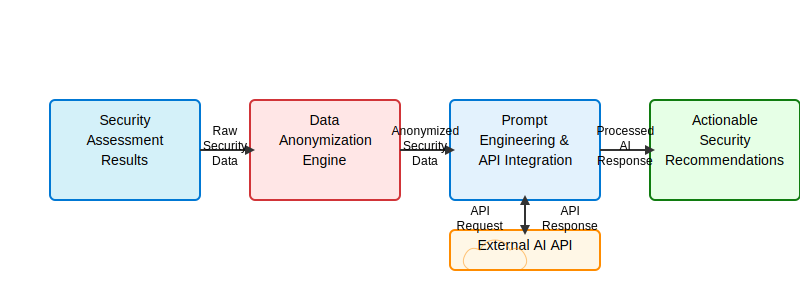

# AI Recommendation Engine

TenetSec includes an AI-powered recommendation engine that analyzes security assessment results to provide contextual, actionable guidance for improving your Microsoft 365 security posture.

## Overview

The AI recommendation engine goes beyond simple pass/fail security checks by:

1. Analyzing security assessment results across all modules
2. Anonymizing tenant data to protect sensitive information
3. Using an external AI API to generate custom recommendations
4. Providing detailed implementation steps for each recommendation
5. Assessing implementation effort and security impact for better prioritization

## How It Works

### Architecture

The AI engine consists of four main components:

1. **Data Anonymization**: Scrubs sensitive tenant information from assessment results
2. **Prompt Engineering**: Creates a structured prompt for the AI API with anonymized assessment data
3. **External AI Processing**: Leverages a powerful AI API to analyze security findings
4. **Response Parsing**: Extracts structured recommendations from the AI response



### Technical Process

#### 1. Data Anonymization

Before any assessment data leaves your environment, the engine thoroughly anonymizes all tenant-specific information:

- Email addresses, domain names, and UUIDs are replaced with deterministic hash values
- User names, tenant IDs, and other identifiers are obfuscated
- Other potential personally identifiable information is removed

This ensures your organization's sensitive data is protected while still allowing the AI to understand the security context.

#### 2. Prompt Engineering

The engine constructs a detailed prompt for the AI API that includes:

- A summary of assessment results by module
- Details of failed security checks including their severity
- The security context needed for actionable recommendations
- Clear instructions for the AI on the format and focus of recommendations

#### 3. External AI Processing

The anonymized data and structured prompt are sent to an external AI API (OpenAI by default):

- The engine calls the AI API with proper authentication
- The AI analyzes the security findings and generates detailed recommendations
- The recommendations include contextual explanations and step-by-step implementation guidance

#### 4. Response Parsing

The engine processes the AI response to extract structured recommendations:

- Parses the AI's response to identify individual recommendations
- Extracts titles, contexts, implementation steps, and effort/impact assessments
- Organizes recommendations for display in the report

## Using AI Recommendations

### Configuration

To use the AI recommendation engine, you need to configure it with API credentials:

#### Using Environment Variables

```bash
export TENETSEC_AI_API_KEY="your-api-key"
export TENETSEC_AI_API_ENDPOINT="https://api.openai.com/v1/chat/completions"
export TENETSEC_AI_API_MODEL="gpt-4"
```

#### Using Config File

In your `config.json` file:

```json
{
  "tenant_id": "your-tenant-id",
  "client_id": "your-client-id",
  "client_secret": "your-client-secret",
  "scopes": [
    "https://graph.microsoft.com/.default"
  ],
  
  "ai_recommendations": {
    "enabled": true,
    "api_key": "your-api-key",
    "api_endpoint": "https://api.openai.com/v1/chat/completions",
    "api_model": "gpt-4"
  }
}
```

### In Reports

AI recommendations appear in all report formats:

1. **HTML Reports**: A dedicated "AI-Powered Recommendations" section with visual indicators for effort and impact
2. **JSON Reports**: An "ai_recommendations" array in the output JSON
3. **Console Reports**: Color-coded recommendations displayed in the terminal

### Interpreting Recommendations

For each recommendation, consider:

1. **Context**: The security issue or vulnerability being addressed
2. **Implementation Steps**: Detailed guidance on how to resolve the issue
3. **Effort Level**: The estimated implementation difficulty:
   - **Low**: Quick configuration changes, minimal testing required
   - **Medium**: Multiple configuration changes, some testing needed
   - **High**: Complex changes, significant testing, possible user impact
4. **Impact Level**: The security improvement potential:
   - **Low**: Incremental security improvement
   - **Medium**: Significant security improvement for specific threats
   - **High**: Major security improvement addressing critical vulnerabilities

## Privacy and Security

The AI recommendation engine is designed with privacy and security in mind:

1. **Data Anonymization**: All tenant-specific data is thoroughly anonymized before being sent to external APIs
2. **No Data Storage**: The engine does not store your assessment data in the external AI service
3. **Transparent Processing**: You can review the exact data being sent in the logs (when debug mode is enabled)
4. **Fallback Mode**: If API access fails or no API key is provided, the engine falls back to mock recommendations

## Configuring Different AI Providers

The engine is designed to work with different AI API providers. By default, it's configured for OpenAI, but you can adapt it to other providers by changing the `api_endpoint` and adjusting the request format as needed.

### Example: Azure OpenAI Service

To use Azure OpenAI Service:

```json
"ai_recommendations": {
  "enabled": true,
  "api_key": "your-azure-api-key",
  "api_endpoint": "https://your-resource-name.openai.azure.com/openai/deployments/your-deployment-name/chat/completions?api-version=2023-05-15",
  "api_model": "gpt-4"
}
```

## Limitations and Future Enhancements

The current implementation has some limitations:

1. Requires an external AI API key
2. Does not incorporate tenant-specific policies or requirements
3. Recommendations are based on point-in-time assessment, not historical data

Future versions may include:

1. More sophisticated anonymization techniques
2. Support for additional AI providers
3. Ability to incorporate tenant-specific security policies
4. Tracking recommendations over time to show security posture improvements

## Technical Reference

For developers who want to extend or customize the AI engine:

- **Source File**: `/tenetsec/ai_recommendations.py`
- **Main Class**: `AIRecommendationEngine`
- **Key Methods**: 
  - `_anonymize_data()`: Handles data privacy
  - `_prepare_api_prompt()`: Creates the AI prompt
  - `_call_ai_api()`: Handles API communication
  - `_parse_api_response()`: Processes recommendations