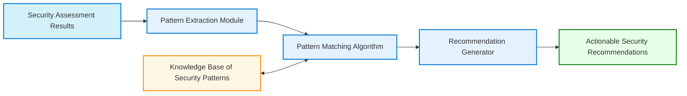

```mermaid
flowchart LR
    A[Security Assessment Results] --> B[Pattern Extraction Module]
    B --> C[Pattern Matching Algorithm]
    D[Knowledge Base of Security Patterns] <--> C
    C --> E[Recommendation Generator]
    E --> F[Actionable Security Recommendations]
    
    style A fill:#d4f1f9,stroke:#0078d4,stroke-width:2px
    style B fill:#e3f2fd,stroke:#0078d4,stroke-width:2px
    style C fill:#e3f2fd,stroke:#0078d4,stroke-width:2px
    style D fill:#fff7e6,stroke:#ff8c00,stroke-width:2px
    style E fill:#e3f2fd,stroke:#0078d4,stroke-width:2px
    style F fill:#e6ffe6,stroke:#107c10,stroke-width:2px
```